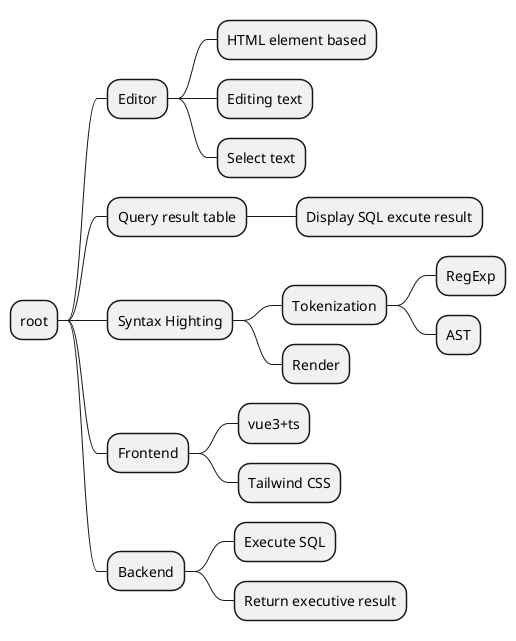

# Tiny SQL editor

## Requirements

1. An editor supporting SQL syntax highlighting.
1. A table list showing the result.
1. Can execute SQL from the editor against a database and return the result to display in the table list. It should support at least 1 database engine (could be one of MySQL, PostgreSQL, SQLite or whatever).

## Mind Map

## Assignment Instruction

1. git clone from [https://github.com/g0ne150/tiny-sql-editor](https://github.com/g0ne150/tiny-sql-editor)
    1. At present, the editor function only supports sql syntax highlighting, single-line editing, input deletion in Chinese and English, move the caret by arrow keys, and currently does not support selecting text, etc.
2. `npm install`
3. `npm run dev`
4. git clone from [https://github.com/g0ne150/tiny-sql-runner](https://github.com/g0ne150/tiny-sql-runner)
5. Install sqlite, like: `brew install sqlite`
6. `go get`
7. `go run main.go`
