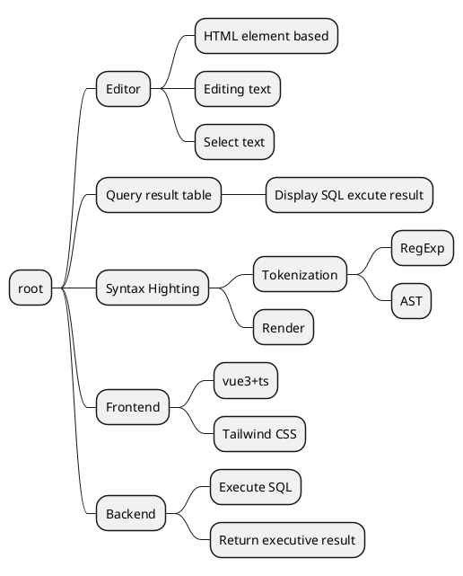

# Tiny SQL editor

## Requirements

1. An editor supporting SQL syntax highlighting.
1. A table list showing the result.
1. Can execute SQL from the editor against a database and return the result to display in the table list. It should support at least 1 database engine (could be one of MySQL, PostgreSQL, SQLite or whatever).

## Mind Map

